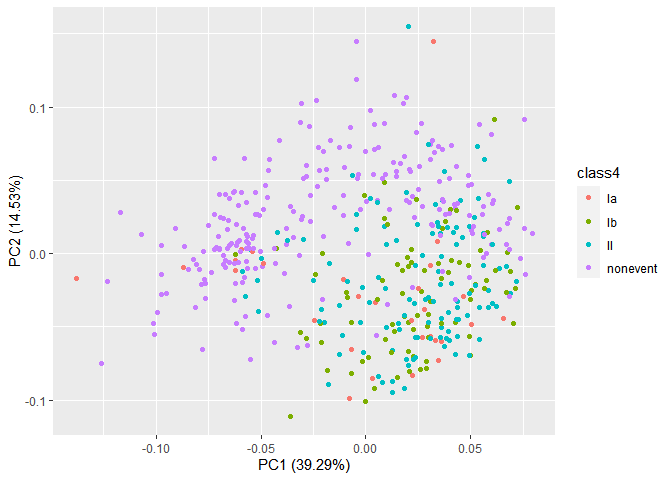
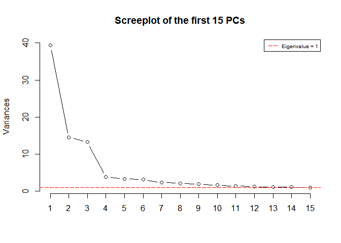
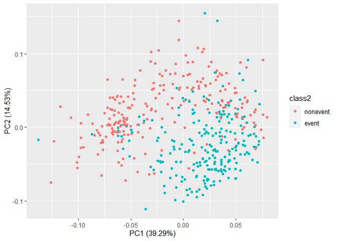

DATA11002 Term project
================

``` r
# Tehdään nää kikat mitä ekassa harkkasetissä
# Voi jatkaa jollain summary-taulukoilla tai korrelaatioploteilla

npf_train <- read.csv("npf_train.csv")
npf_test <- read.csv("npf_test_hidden.csv")

rownames(npf_train) <- npf_train[,"date"] 
npf_train <- npf_train[,-(1:2)]
npf_train <- npf_train[,-2]

npf_train$class2 <- factor("event",levels=c("nonevent","event"))
npf_train$class2[npf_train$class4=="nonevent"] <- "nonevent"
```

``` r
npf.pca <- prcomp(npf_train[, c(2:101)], center = TRUE, scale. = TRUE)

#Katotaan 10 ekan komponentin selitysvoima
summary(npf.pca)$importance[,1:10]
```

    ##                             PC1      PC2      PC3      PC4      PC5     PC6
    ## Standard deviation     6.268071 3.811647 3.637304 1.956812 1.842751 1.77893
    ## Proportion of Variance 0.392890 0.145290 0.132300 0.038290 0.033960 0.03165
    ## Cumulative Proportion  0.392890 0.538170 0.670470 0.708760 0.742720 0.77437
    ##                             PC7      PC8      PC9    PC10
    ## Standard deviation     1.540581 1.472957 1.406122 1.28705
    ## Proportion of Variance 0.023730 0.021700 0.019770 0.01656
    ## Cumulative Proportion  0.798100 0.819800 0.839570 0.85613

``` r
# Tsekkaillaan visuaalisesti (tää heittää mulla ainakin warningia jos ajaa konsoliin mutta latoo ihan ok?)

screeplot(npf.pca, type = "l", npcs = 15, main = "Screeplot of the first 15 PCs")
abline(h = 1, col="red", lty=5)
legend("topright", legend=c("Eigenvalue = 1"),
       col=c("red"), lty=5, cex=0.6)
```

<!-- -->

``` r
# Eigenvalue 1 lähestyy 7 komponentin nurkilla

cumpro <- cumsum(npf.pca$sdev^2 / sum(npf.pca$sdev^2))
plot(cumpro[0:15], xlab = "PC #", ylab = "Amount of explained variance", main = "Cumulative variance plot")
abline(v = 7, col="blue", lty=5)
abline(h = 0.7981, col="blue", lty=5)
legend("topleft", legend=c("Cut-off @ PC7"),
       col=c("blue"), lty=5, cex=0.6)
```

<!-- -->

``` r
# Näyttäisi siltä että 7 komponenttia selittää 79,8% varianssista - komponenttien määrän lisääminen ei enää hirveästi kasvata selitysvoimaa -> Olisko tässä hyvä vai tarvisko pienentää?
```

``` r
#install.packages("ggfortify")
# Vähän lisätutkailua class2 ja class4 jakautumisesta kahteen ekaan komponenttiin
library(ggfortify)
```

    ## Loading required package: ggplot2

``` r
autoplot(npf.pca, data = npf_train, colour = 'class2')
```

<!-- -->

``` r
autoplot(npf.pca, data = npf_train, colour = 'class4')
```

<!-- -->

``` r
# Laitetaan PCA-komponenttien pisteet datasettiin mukaan havainnoille
npf_train <- cbind(npf_train, npf.pca$x[, c(1:7)])

#muunnetaan factor-muotoon class-muuttujat
npf_train$class2 <- as.factor(npf_train$class2)
npf_train$class4 <- as.factor(npf_train$class4)

#logistinen regressio
log_reg <- glm(class2 ~ PC1+PC2+PC3+PC4+PC5+PC6+PC7, data = npf_train, family = "binomial")

#ennustetaan treeniaineistolle (kunnei muuta voida...)
train_preds <- predict(log_reg, newdata=npf_train)

#treeniaineiston accuracy
lr_acc <- mean(ifelse(train_preds>=0.5,"event","nonevent")==npf_train$class2)

#ajetaan treeniaineiston fit testidatalle
test_pca <- predict(npf.pca, newdata = npf_test)

npf_test <- cbind(npf_test, test_pca[, c(1:7)])

#logistinen regressio testiaineistolle
npf_preds <- predict(log_reg, newdata=npf_test, type = "response")

#ennustettu luokka
npf_test$class2 <- ifelse(npf_preds>=0.5,"event","nonevent")

# samat naive bayesilla

library(e1071)

nb_fit <- naiveBayes(class2 ~ PC1+PC2+PC3+PC4+PC5+PC6+PC7, data = npf_train)
nb_preds <- predict(nb_fit, newdata=npf_train)

nb_acc <- mean(nb_preds==npf_train$class2)

# yhteen ja tehdään taulukko

accs = c(lr_acc, nb_acc)

df <- data.frame(accs)
row.names(df) = c("Logistic regression","Naive Bayes")
colnames(df) = c("Accuracy")

knitr::kable(df, caption="Training set accuracies for different models")
```

|                     |  Accuracy |
|:--------------------|----------:|
| Logistic regression | 0.8318777 |
| Naive Bayes         | 0.8340611 |

Training set accuracies for different models
