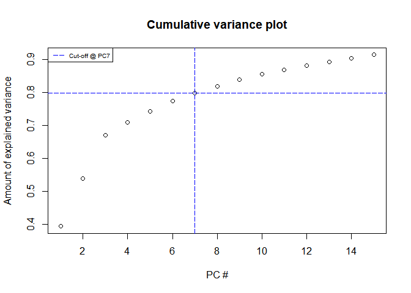

DATA11002 Term project
================

``` r
# Tehdään nää kikat mitä ekassa harkkasetissä
# Voi jatkaa jollain summary-taulukoilla tai korrelaatioploteilla

npf_train <- read.csv("npf_train.csv")
npf_test <- read.csv("npf_test_hidden.csv")

rownames(npf_train) <- npf_train[,"date"] 
npf_train <- npf_train[,-(1:2)]
npf_train <- npf_train[,-2]

npf_train$class2 <- factor("event",levels=c("nonevent","event"))
npf_train$class2[npf_train$class4=="nonevent"] <- "nonevent"
```

``` r
npf.pca <- prcomp(npf_train[, c(2:101)], center = TRUE, scale. = TRUE)

#Katotaan 10 ekan komponentin selitysvoima
summary(npf.pca)$importance[,1:10]
```

    ##                             PC1      PC2      PC3      PC4      PC5     PC6
    ## Standard deviation     6.268071 3.811647 3.637304 1.956812 1.842751 1.77893
    ## Proportion of Variance 0.392890 0.145290 0.132300 0.038290 0.033960 0.03165
    ## Cumulative Proportion  0.392890 0.538170 0.670470 0.708760 0.742720 0.77437
    ##                             PC7      PC8      PC9    PC10
    ## Standard deviation     1.540581 1.472957 1.406122 1.28705
    ## Proportion of Variance 0.023730 0.021700 0.019770 0.01656
    ## Cumulative Proportion  0.798100 0.819800 0.839570 0.85613

``` r
library(ggfortify)
```

    ## Loading required package: ggplot2

``` r
autoplot(npf.pca, data = npf_train, colour = 'class4')
```

    ## Warning: `select_()` was deprecated in dplyr 0.7.0.
    ## Please use `select()` instead.
    ## This warning is displayed once every 8 hours.
    ## Call `lifecycle::last_lifecycle_warnings()` to see where this warning was generated.

<!-- -->

``` r
# Tsekkaillaan visuaalisesti (tää heittää mulla ainakin warningia jos ajaa konsoliin mutta latoo ihan ok?)

screeplot(npf.pca, type = "l", npcs = 15, main = "Screeplot of the first 15 PCs")
abline(h = 1, col="red", lty=5)
legend("topright", legend=c("Eigenvalue = 1"),
       col=c("red"), lty=5, cex=0.6)
```

<!-- -->

``` r
# Eigenvalue 1 lähestyy 7 komponentin nurkilla

cumpro <- cumsum(npf.pca$sdev^2 / sum(npf.pca$sdev^2))
plot(cumpro[0:15], xlab = "PC #", ylab = "Amount of explained variance", main = "Cumulative variance plot")
abline(v = 7, col="blue", lty=5)
abline(h = 0.7981, col="blue", lty=5)
legend("topleft", legend=c("Cut-off @ PC7"),
       col=c("blue"), lty=5, cex=0.6)
```

<!-- -->

``` r
# Näyttäisi siltä että 7 komponenttia selittää 79,8% varianssista - komponenttien määrän lisääminen ei enää hirveästi kasvata selitysvoimaa -> Olisko tässä hyvä vai tarvisko pienentää?
```

``` r
#install.packages("ggfortify")
# Vähän lisätutkailua class2 ja class4 jakautumisesta kahteen ekaan komponenttiin
library(ggfortify)

autoplot(npf.pca, data = npf_train, colour = 'class2')
```

<!-- -->

``` r
autoplot(npf.pca, data = npf_train, colour = 'class4')
```

<!-- -->

``` r
#Laitetaan PCA-komponenttien pisteet datasettiin mukaan havainnoille
npf_train <- cbind(npf_train, npf.pca$x[, c(1:7)])

#muunnetaan factor-muotoon class-muuttujat
newc2<-rep(0, 458)
for (i in 1:458){
  if (npf_train$class2[i]=="event"){
    newc2[i]<-1
  }
}
npf_train$class2<-newc2
npf_train$class2 <- as.factor(npf_train$class2)
npf_train$class4 <- as.factor(npf_train$class4)

trains<-npf_train[,-1]
test<-trains[300:458,]
trains<-trains[1:259,]
#logistinen regressio


#ajetaan treeniaineiston fit testidatalle
test_pca <- predict(npf.pca, newdata = npf_test)
npf_test <- cbind(npf_test, test_pca[, c(1:7)])
#logistinen regressio testiaineistolle
#npf_preds <- predict(log_reg, newdata=npf_test, type = "response")
#ennustettu luokka
#npf_test$class2 <- ifelse(npf_preds>=0.5,"event","nonevent")
# samat naive bayesilla
library(e1071)

# näyttää pdf-formaatissa erilaiselta (=paremmalta)...
```

``` r
library(caret)
```

    ## Loading required package: lattice

``` r
library(ranger)
#Cross validation:
trctrl<-trainControl(method = "cv", number = 5)
log_fit<-train(class2~PC1+PC2+PC3+PC4+PC5+PC6+PC7,data=npf_train,method="glm",family="binomial",trControl=trctrl)
nb_fit<-train(class2~PC1+PC2+PC3+PC4+PC5+PC6+PC7,data=npf_train,method="naive_bayes",trControl=trctrl)
rf_fit<-train(class2~PC1+PC2+PC3+PC4+PC5+PC6+PC7,data=trains,method="ranger",trControl=trctrl)


CVs<-c(log_fit$results$Accuracy,nb_fit$results$Accuracy[1],rf_fit$results$Accuracy[1])

#Test set accuracy:
#Log reg
log_reg <- glm(class2 ~ PC1+PC2+PC3+PC4+PC5+PC6+PC7, data = trains, family = "binomial")
lr_preds<-predict(log_reg,newdata=test)
lr_acc <- mean(ifelse(lr_preds>=0.5,"1","0")==test$class2)
#NB
nb_fit <- naiveBayes(class2 ~ PC1+PC2+PC3+PC4+PC5+PC6+PC7, data = trains)
nb_preds <- predict(nb_fit, newdata=test)
nb_acc <- mean(nb_preds==test$class2)
#RF
pred<-predict(rf_fit,test)
rf_acc<-1-mean((as.numeric(pred)-as.numeric(test$class2))^2)

# yhteen ja tehdään taulukko
accs = c(lr_acc, nb_acc,rf_acc)
df <- data.frame(accs)

row.names(df) = c("Logistic regression","Naive Bayes", "Random Forest")

df$CV_accuracy<-CVs
colnames(df) = c("Test set accuracy", "Cross validation accuracy")
knitr::kable(df, caption="Test set accuracies and cross validation accuracies for different models")
```

|                     | Test set accuracy | Cross validation accuracy |
|:--------------------|------------------:|--------------------------:|
| Logistic regression |         0.8364780 |                 0.8165552 |
| Naive Bayes         |         0.8050314 |                 0.8318442 |
| Random Forest       |         0.8364780 |                 0.8107089 |

Test set accuracies and cross validation accuracies for different models
